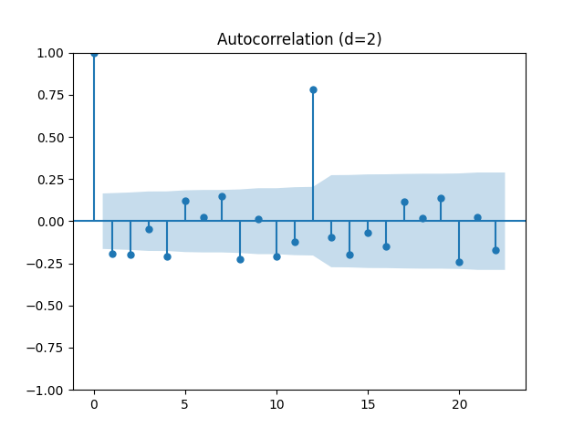
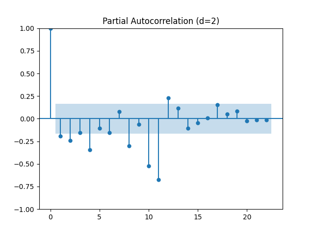
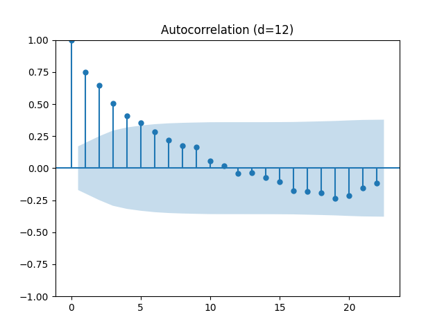
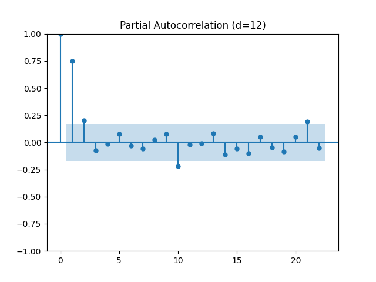
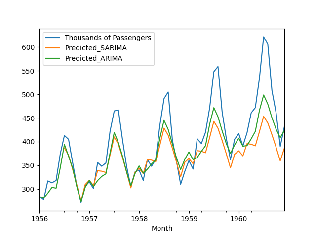

# Time Series Forecasting 

## Time Series Forecasting using ARIMA and SARIMA

## Dataset

|index|Month|Thousands of Passengers|
|---|---|---|
|0|1949-01|112|
|1|1949-02|118|
|2|1949-03|132|
|3|1949-04|129|
|4|1949-05|121|

## Output

- Autocorrelation plot for 2nd differencing
 

 
 

- Partial Autocorrelation plot for 2nd differencing
 

 
 

- Autocorrelation plot for 12th differencing
 

 
 

- Partial Autocorrelation plot for 12th differencing
 

 
 

## Prediction
 

 
 

